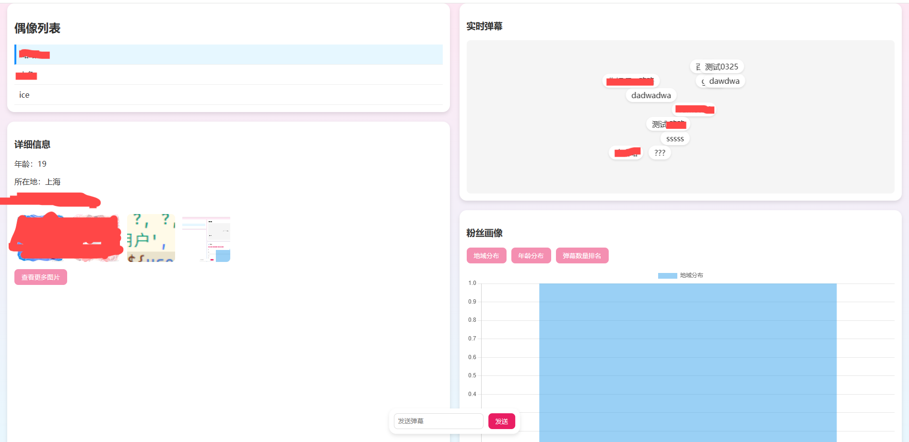

# ug-idol 地下偶像应援站

一个偶像应援网站，提供实时弹幕互动、偶像信息展示和粉丝社区功能。


#### 本人 `嘎比` 一个，微博ID:阿伟伟阿_           欢迎交流


> 🤡 本人s完全没学过 js、css、html、Node.js，代码功底也差
>
> 🤡 整体使用 AI + 个人微调完成，质量堪忧（手动加小丑面具🤡<br />


页面预览



## 🌟 功能特性

- 🎭 **偶像信息展示**
  - 偶像基本资料
  - 图片相册展示
  - 个人主页链接

- 💬 **实时弹幕互动**
  - 实时弹幕发送与显示
  - 历史弹幕查看
  - WebSocket实时通信

- 👥 **用户系统**
  - 用户注册与登录
  - 个人资料管理
  - 密码修改功能

- 📊 **粉丝画像**
  - 粉丝地域分布
  - 年龄统计
  - 数据可视化展示

## 🛠 技术栈

- **后端**
  - Node.js
  - Express.js
  - Socket.IO
  - MySQL2

- **前端**
  - HTML5
  - CSS3
  - JavaScript
  - WebSocket

- **数据库**
  - MySQL

## 🚀 快速开始

### 前置要求

- Node.js (v12+)
- MySQL (v5.7+)
- npm 或 yarn

### 安装步骤

1. 克隆项目
```bash
git clone [项目地址]
cd ug-idol
```

2. 安装依赖
```bash
npm install
```

3. 配置数据库
- 创建MySQL数据库 `idol_msg`
- 修改 `server.js` 中的数据库配置：
```javascript
const dbConfig = {
    host: '127.0.0.1',
    user: 'your_username',
    password: 'your_password',
    database: 'idol_msg'
};
```

4. 启动服务器
```bash
npm start
```

访问 http://localhost:3000 即可看到应用界面

## 📝 项目结构

```
.
├── public/                # 静态资源目录
│   ├── css/              # 样式文件
│   ├── images/           # 图片资源
│   ├── *.html           # 页面文件
│   └── script.js        # 前端脚本
├── server.js            # 服务器入口文件
├── package.json         # 项目配置文件
└── README.md           # 项目说明文档
```

## 🔧 开发模式

```bash
npm run dev
```
使用 nodemon 运行服务器，支持热重载

## 📄 许可证

本项目采用 MIT 许可证 - 查看 [LICENSE](LICENSE) 文件了解详情

## 🤝 贡献

欢迎提交问题和功能请求。如果您想贡献代码，请提交 pull request。

## 🔮 未来计划

- [ ] 添加更多互动功能
- [ ] 优化弹幕性能
- [ ] 增加数据分析功能
- [ ] 支持更多媒体类型